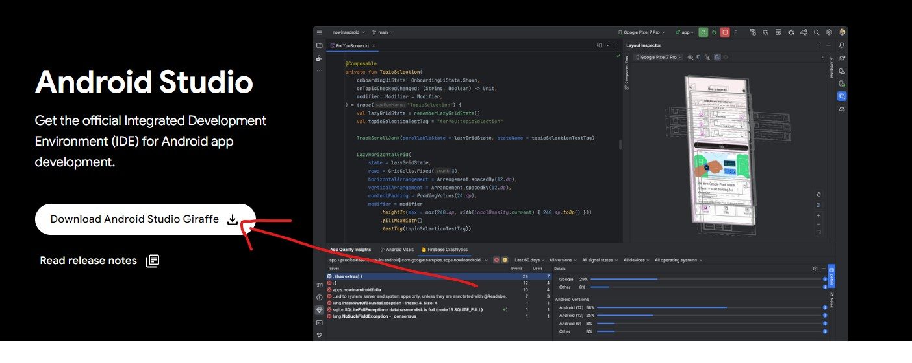
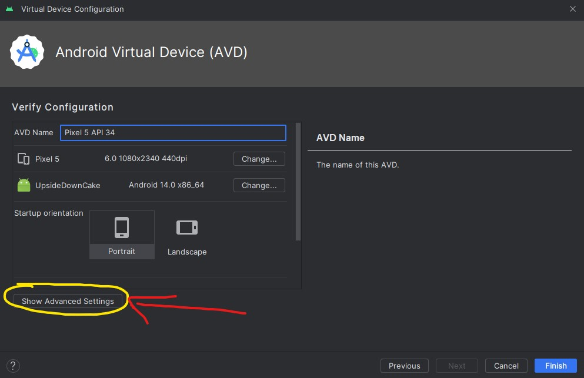

# Instalacja środowiska

## Node.js
#### Windows
**1. Pobranie Node.js**
Na początku trzeba zainstalować środowisko Node.js, wchodzimy w link: https://nodejs.org/en/download i pobieramy.

  

**2. Instalacja**
Postępujemy zgodnie z instrukcjami na ekranie. 

**3. Spradzenie poprawności instalacji**
Po zakończeniu sprawdzamy czy Node.js został poprawnie zainstalowany wpisująć następujące polecenie w wierszu poleceń (cmd):

`node -v`

Powinna pojawić się obecna wersja node.js

  

#### Linux
**1. Instalacja** 
Instalujemy Node.js z poziomu terminala:
`sudo apt update`
`sudo apt install nodejs`
**2. Spradzenie poprawności instalacji**
Następnie sprawdzamy czy środowisko zostało poprawnie zainstalowane:
`node -v`

## Emulator
#### Windows
**1. Pobierz Android Studio**
Przejdź na oficjalną stronę Android Studio https://developer.android.com/studio i pobierz najnowszą wersję.

  

**2. Zainstaluj Android Studio**
Po pobraniu uruchom instalator i postępuj zgodnie z instrukcjami na ekranie.

**3. Uruchom Android Studio**
Po instalacji uruchom Android Studio. Po pierwszym uruchomieniu program poprosi Cię o skonfigurowanie środowiska. Postępuj zgodnie z instrukcjami, w tym instalacją niezbędnych komponentów.

**4. Otwórz AVD Manager**

  
  

**5. Dodaj nowy emulator**
Kliknij przycisk "Create Virtual Device".

  

**6. Wybierz urządzenie**
Wybierz urządzenie, dla którego chcesz utworzyć emulator. Następnie postępuj zgodnie z instrukcjami kreatora.

  

**7. Wybierz obraz systemu Android:**
Wybierz obraz systemu Android, który chciałbyś zainstalować na swoim emulatorze. Możesz wybrać oficjalne obrazy udostępniane przez Google.

  

**8.Skonfiguruj emulator**
Skonfiguruj dodatkowe opcje, takie jak ilość dostępnej pamięci RAM dla emulatora.

  
  

**10.Zakończ konfigurację**
Po zakończeniu konfiguracji, kliknij "Finish", aby zakończyć proces tworzenia emulatora.

  

**11. Uruchom emulator**
Wróć do AVD Manager, zaznacz stworzony emulator i kliknij przycisk "Play", aby uruchomić emulator.

  

#### Linux
**1. Pobierz Android Studio**
Otwórz terminal i użyj poleceń do pobrania i rozpakowania Android Studio.
`wget https://redirector.gvt1.com/edgedl/android/studio/ide-zips/4.2.2.0/android-studio-ide-202.7486908-linux.tar.gz`
`tar -xzvf android-studio-ide-202.7486908-linux.tar.gz`

**2. Uruchom Android Studio**
Wejdź do katalogu, w którym rozpakowano Android Studio, a następnie uruchom studio.sh
`cd android-studio/bin`
`./studio.sh`

**3. Skonfiguruj Android Studio**
Po pierwszym uruchomieniu, postępuj zgodnie z instrukcjami kreatora konfiguracji środowiska programistycznego.

Następnie przejdź do 4.kroku instrukcji windowsa i postępuj identycznie.